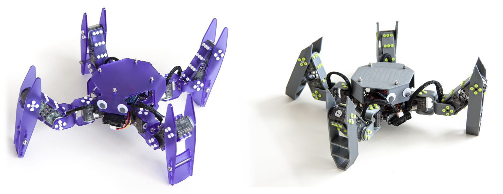

# The Metabot open-source quadruped robot

Metabot is an open-source DIY quadruped robotics platform. It can be 3D printed or
laser cutted (3mm acrylic).

Note that [the robot is now available as a kit](http://metabot.cc).
In this repository you will find all the open-source material to make (or hack) your own.

* [Bill of material](docs/bom.md)
* Mechanics
    * [3D Parts](mechanics/3d)
    * [Laser parts](mechanics/laser)
* [Electronics](electronics)
* [Firmware](firmware)
* [Joypad firmware](dfpad)

You can control the robot using the Metabot app (available on the Play Store)

[To get information about the previous robot version, see branch V1](https://github.com/Rhoban/Metabot/tree/v1)

## License

This project is under CC BY-NC license:
http://creativecommons.org/licenses/by-nc/3.0/
