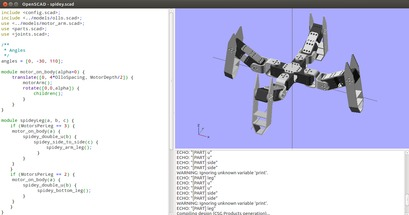

# Hacking the 3D parts

[« back to the hacking documentation](hacking.md)

## Using OpenSCAD

[OpenSCAD](http://www.openscad.org/) is a free, lightweight and open-source software.
You can download it from the [officiel site](http://www.openscad.org/downloads.html).

You'll find the scad parts in the `3d/scad/` directory of this repository.

### Changing the robot configuration

First, you can open `metabot/metabot.scad` and render it pressing F5. This will show
you the robot. You can then edit `metabot/config.scad`, changing some settings, like
the size of the body, the number of legs or the number of motors per leg. Then hit
F5 again and have a look to the changed robot. 

You can read the `config.scad` comments for more information on what can be changed.

### Generating print files

The files you'll need to print are in `metabot/print/`, you'll have to open it and then
export it to .stl for your 3D printer.

Note that the `side.scad` file may not be required if you have only 2 motors per leg.

Note that you can also run the `make` command in the scad repository, this will generate all the
`.stl` files for you.

### Organization

If you want to go further, change parts or add new one, here is the tree of files:

* `models/`: contain models of "real-life" things (in this case, the motor and its arm)
* `parts/`: contains generic 3D printable parts
* `joints/`: contains generic joints. A joint is a module that start from a motor, add
  some mechanics and possibly a new motor.
* `metabot/` contains the metabot-specific file, with:
  * `metabot.scad`: the main assembly of the robot
  * `config.scad`: the configuration of the robot
  * `joints.scad` and `parts.scad`: generic parts instanciated for the robot using
    the configuration
  * `print/`: convenient `.scad` files to easily get printable version of files

This architecture allow you to create your own robot, re-using generic parts.

## Using Autodesk Inventor

You can use the Autodesk Inventor CAD software. It is free for students, and a 30-days
trial is available freely on their site.

To learn how to use this software, you may want to follow some youtube tutorials and
read the official documentation.

You'll find the autodesk 3D parts in `3d/autodesk` directory of this repository. These
files extension is `.ipt`.

The directory `models/` contains "real-life" things that were designed for the assembly.

The directory `parts/` contains the parts that have to be 3D-printed. These files have the
same name that the `.stl` available in `3d/`.

The `metabot.iam` is the assembly of the robot. Note that it is less parametric that with
OpenSCAD.
