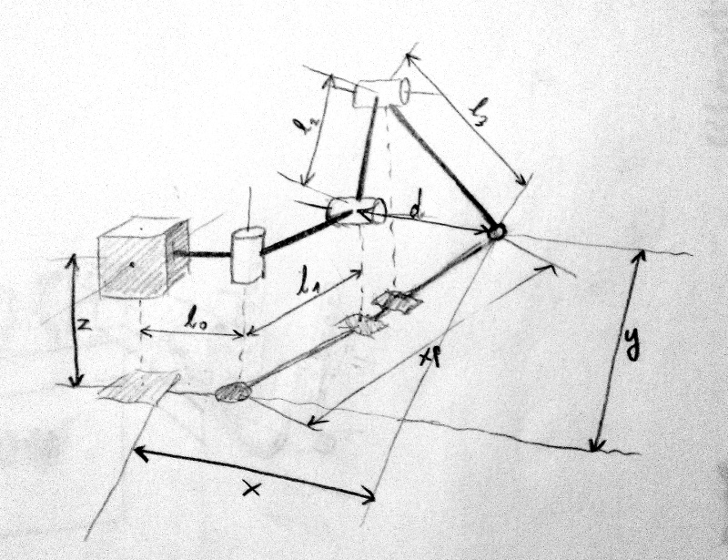

# Kinematic

[« back to the hacking documentation](hacking.md)

Metabot use a geometric model of its legs to work. The code can be
found in `kinematic.h` and `kinematic.cpp`, it was commented for more
understandability.

Here is a draw explaining what the different values represents:

(Thanks to Radomir Dopieralski for the draw)

The role of `kinematic.cpp` is then to compute the value of the three
angles (`alpha`, `beta` and `gamma`) of the motors to reach a given
cartesian (`x`, `y` and `z`) position.
