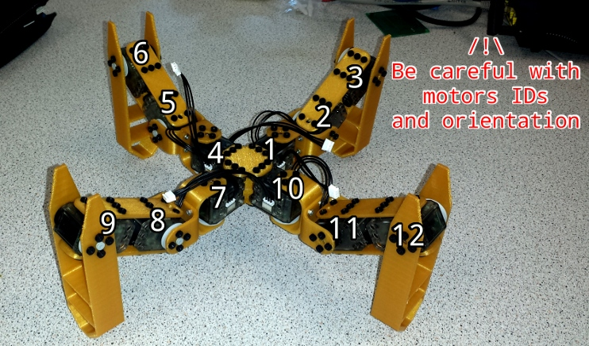

# Numbering servos

[« back to the documentation](index.md)

Once you have [put the firmware](firmware.md) on the OpenCM++, you can now open
the terminal with:

```
cu -l /dev/ttyACM0
```

On Linux, or using [PuTTy](http://www.putty.org/) on Windows.

In the terminal, you can type the following command to scan for servos:

```
$ dxl_scan
```

This should tell you whether the servos are present.

Now, we'll number the servos from 1 to 12, let's take one and connect it to the OpenCM++,
if you do the scan, you should see that servo 1 is present. Now let's type:

```
dxl_configure 1
```

This will configure the servo and give it the id 2. You can now disconnect it, connect
the next one and so on until you reach 12.

To make things simplier, just keep a trace of the IDs, you can use stickers or write on the
servos to remember its IDs.

This is where the servos will go:



If you did a mistake, you can change the number of a servo by specifying a second argument:

```
dxl_configure <newId> <oldId>
```

Thus:

```
dxl_configure 3 2
```

Will change the id of the servo 2 to 3.
