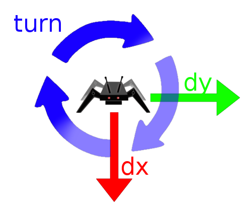

# Motion

[« back to the documentation](index.md)

The motion is computed on-board using [reverse kinematic](hacking_kinematic.md) of the 
legs.

Once your robot is built and setup, you can begin sending it motion orders.

**Note: please be sure to have a good power suply for your robot, it is not safe to
power it in motion using USB port, you'll need something more powerful like a LiPo
or Lion battery**

## Start and stop

The commands `start` and `stop` can be used to enable or disable torque in servos. When
the robot starts, it turns green during a few seconds (the power is increased progressively
in the servos). When it is stopped, servos turn red.

## Front of the robot

Once the robot is started, the front of the robot is showed using the two pink leds

## Basic commands to move the robot

There is a lot of parameters to move your robot, each parameter can be changed using either
`=` or space, like:

```
$ dx=15.0
or
$ dx 15.0
```

Basics parameters are:

* `dx`: in mm per step: the move in the front axis (see below)
* `dy`: (same for lateral axis, see below)
* `turn` in ° per step: the rotation of the robot



## Other options

* `backLegs`: using legs backward (the small part that is usually up comes below)
* `back`: using the robot back, you can then return the robot and using it in the other
  side, if your electronics allow that
* `freq`: the frequency of the walk, default is 2 (for 2hz, or 2 cycles per second)
* **You can change the posture of the robot, BE CAREFUL, this can really mess up if you
  pass too big values here**:
    * `h`: the height of the legs when stopped, default to -70mm
    * `r`: the radius of the legs (distance to between arm of first servo of each leg and
      arm of the last servo) default to 80mm


