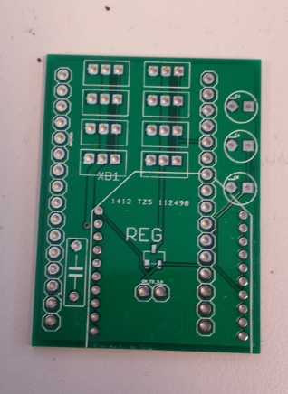
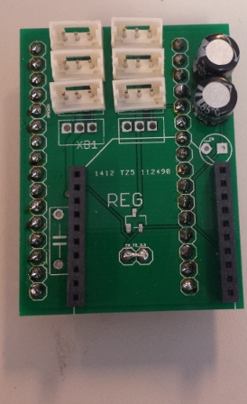

# OpenCM++

[« back to the documentation](index.md)

The OpenCM++ board is a simple OpenCM9.04 shield that allow you to use the XBee socket and having a 8-ports dynamixel XL-320 hub.

You'll find gerber, schematics, board and components list in the `board/` directory of this repository.

## Board

## Board (with components)

