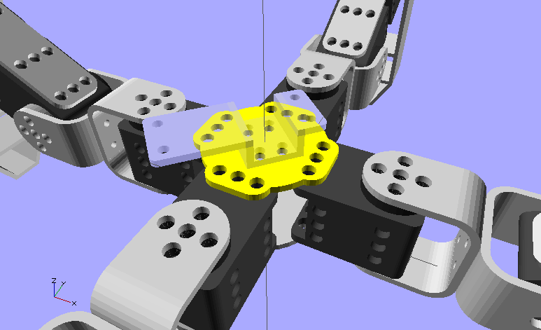
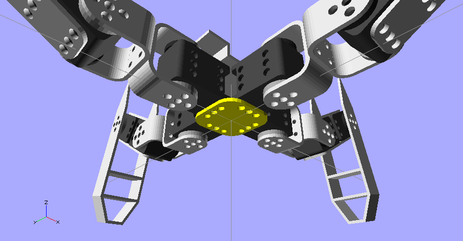
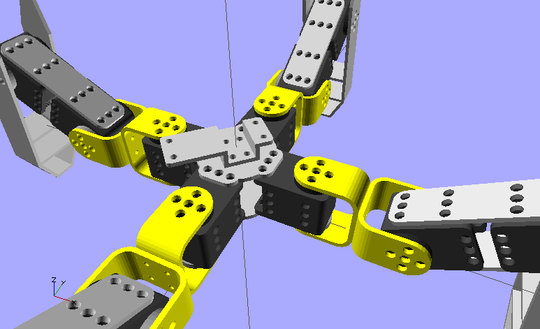
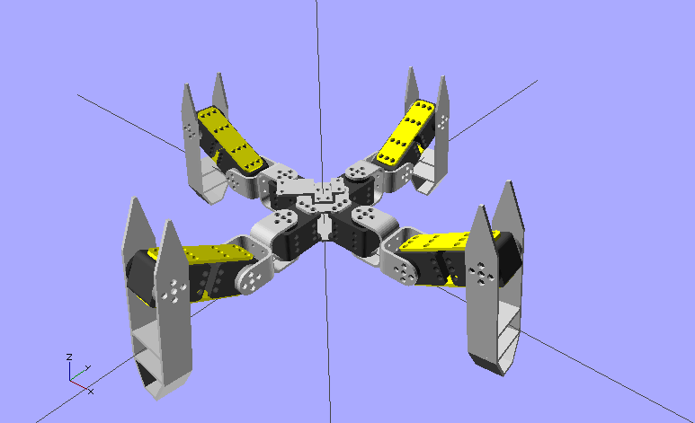
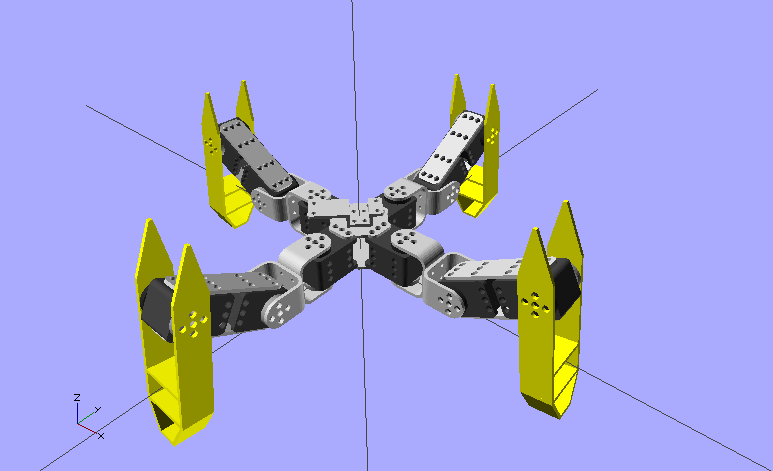

# Parts list

[« back to the documentation](index.md)

To build your own Metabot, you'll need the following parts

## 3D parts

You need all the 3D printed parts that are in the `3d` directory, you'll need to print:

### Body Top (x1)

This is the top of the body, with holes to put the batteries:

 

### Body Bottom (x1)

 

### U (x8)

 

### Side (x8)

 

### Leg (x4)

 

## Motors

### 12 x XL-320

http://www.robotis-shop-en.com/?act=shop_en.goods_view&GS=1611

## Bindings

### 3 x Ollo rivet boxes

www.robotis-shop-en.com/?act=shop_en.goods_view&GS=1605

### Ollo board

You'll have to buy 2 5x12 Ollo boards:

http://www.robotis-shop-en.com/?act=shop_en.goods_view&GS=1573

### Ollo tool

You may need an ollo tool to work with ollo rivet:

http://www.robotis-shop-en.com/?act=shop_en.goods_view&GS=1602

### Pulleys

You'll need 12 pulleys, you can buy 3x5=15:

http://www.robotis-shop-en.com/?act=shop_en.goods_view&GS=1590

### Screws & nuts

To bind the Us and the batteries on the body, you'll also need M3x8 screws & nuts (about 30 qty).

## Electronic

### Main board: OpenCM9.04-C

http://www.robotis-shop-en.com/?act=shop_en.goods_view&GS=2394

## Battery

We recommend using the ROBOTIS Li-ion:

2x http://www.robotis-shop-en.com/?act=shop_en.goods_view&GS=1608

2x http://www.robotis-shop-en.com/?act=shop_en.goods_view&GS=1609

## Bluetooth module

You can also buy BT-210 module:

http://www.robotis-shop-en.com/?act=shop_en.goods_view&GS=1484
